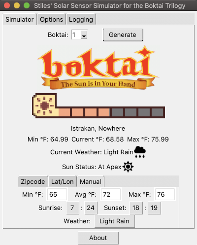
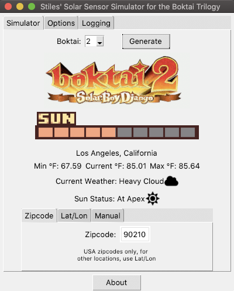
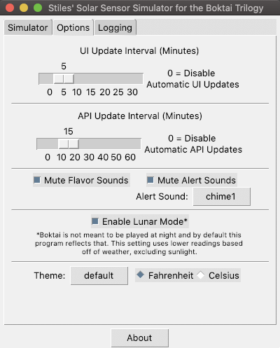

======
README
======

boktaisim is a small tkinter application and library to make playing the Boktai trilogy of games
more easy. For more information, read through the `Background` section.

|
|

-----------
Screenshots
-----------

Boktai 1 using manual data

|boktai1|

Boktai 2 using zipcode

|boktai2|

Options screen

|options|

|
|

----------
Background
----------

~~~~~~~~~~~~~~~~~~~~~~~~~~~~~~~
Nathan Stiles, Ideas and Design
~~~~~~~~~~~~~~~~~~~~~~~~~~~~~~~

The initial goal of this project was to create a way for me to play and record the Boktai trilogy that was reminiscent of the original intent, without the need for sunlight. While I could never properly preserve the true Boktai experience of using a flaky solar sensor, contending with the glare of the sun on the GBA screen, and slowly succumbing to sun burn... I could at least come up with an alternative. Of course I couldn't make an actual solar sensor to be used in doors, so I chose to base my 'sun reading' on weather instead. I later found out that Boktai 4, known as Lunar Knights outside of Japan, handled it's energy meters in a similar way, which was a happy accident.

The more I thought about it, the more I realized how useful this tool could be to Boktai fans around the world. Boktai and Boktai 2 carts are becoming harder and harder to come by, and Boktai 3 never left Japan, requiring a fan translation to be enjoyed by anyone who can't read the language. To make matters worse, the carts that are available won't last forever: their batteries are dying and I don't how long the life of the solar sensors themselves are. So I've decided to make this alternative, imperfect as it may be, public for anyone to use!

The first and most important thing to note about the program is that it does not interact with the rom or emulator in any way. I have been playing the game through Retroarch_ using the mGBA_ core which has a sunlight sensor setting. You can actually map the raising and lowering of the sun meter to buttons on your keyboard or controller to fill the bar manually. Personally, I didn't feel it was worth the extra effort to code a connection through Bizhawk_ when a couple of simple button presses achieves the same solution with an emulator that I already know has the features I want and need. Obviously this program is open source though, so if you want to take a crack at it, then by all means do so!

What the app does do is generate an artificial sunlight reading that you can manually input into the game as you play. The program will give a chime at set intervals if there is a change to how much sunlight your in-game meter should have. This allows you to keep it open in the background while you play and not have to worry about checking it manually every couple of minutes. To generate the readings we used a formula combining temperature relative to the low and high forecast for the day, weather status (Clear Skies, Partial Clouds, Rain etc), position of the sun from sunrise to sunset, and a bit of RNG to determine how much 'sunlight' the meter is getting at any one time. We thought that these particular parameters would make the game playable by everyone around the world, as opposed to just naturally 'hot' environments with clear skies all the time (though, those areas will tend to have higher average readings of course).

Some of you may be asking why I'd go through all this trouble when the `Myboy GBA emulator`_ actually has a setting that uses the phones camera to fill Boktai's sun meter based on how much light it sees. I debated playing this way, but I just can't get in the groove of playing an action adventure game with touch controls. It also doesn't fit with the theming of Boktai very well, in my opinion. The camera will use any light, not just UV rays, so it's not really based around nature anymore. This may be nitpicky, but it felt less authentic to me. That said if you are fine with playing on your smart phone, Myboy is a great alternative to this project, and arguably a simpler solution.

The only other thing you may be scratching your head about after looking at the program is... 'Lunar Mode'. Boktai, by default, is not meant to be played for long periods at night; In fact, some parts of the game are impossible to progress without sunlight. By default the program reflects this, but after further thinking we decided to implement an optional 'Lunar Mode' to make the game playable at all hours. We tried to keep the spirit of the game and program in tact by making the lunar readings cap out at a much lower level than they would during the day, while still making the game fully playable, if a bit more challenging.

I think that just about covers it. If you are feeling generous you can check out my `Youtube channel`_ for some in-depth analysis of RPGs or more casual reviews of other content... like Boktai once those videos are done! Now if you'll excuse me, I've got more Boktai to play. Thank you all for reading!

-- Nathan Stiles, of Stiles' Reviews

|
|

~~~~~~~~~~~~~~~~~~~~~~
Connor Barthold, Coder
~~~~~~~~~~~~~~~~~~~~~~

It seemed like a neat project.

-- Connor Barthold, of The Internet

|
|

-----
Setup
-----

No special setup is required, everything should run out of the box after installation or download. If you want to view the distributions of possible values available, `matplotlib`_ is required.

|
|

-------------
Configuration
-------------

A default config file will be generated on first run and stored in the user's application data directory (utilizing the `appdirs`_ package). This file contains both configuration settings and the last input data, and is saved automatically any time either of these changes.

|
|

-----
Usage
-----

~~~~~~~~~~~~~~~~~~~~~~~~~~~~
Running as a GUI Application
~~~~~~~~~~~~~~~~~~~~~~~~~~~~

This is the main way the package is intended to be used. Simply run `boktaisim` after installing with `python setup.py install` to launch the tkinter interface. Alternatively, launch `boktaisim.app` or `boktaisim.exe` if using one of the pre-packaged executables.

|
|

~~~~~~~~~~~~~~~~~~~~~~
Importing as a Library
~~~~~~~~~~~~~~~~~~~~~~

The `BoktaiSim` class can be imported and used directly without a GUI interface.

>>> from boktaisim.classes import BoktaiSim
>>> sim = BoktaiSim(version=2, zipcode=90210)
>>> sim.value
6
>>>

|
|

----------------
Value Generation
----------------

The value generated by boktaisim is the average of four values::

 temperature    The high, low, and current temperature value is taken from weather API data.
                These values are scaled to between 0 and 10 (or 0 to 8 for Boktai 1).
 weather        The high, low, and current temperature value is taken from weather API data.
                These values are then scaled to between the current weather state's min and max
                values taken from a static dict in `boktaisim.constants`.
 sun            The current position of the sun is used as an input to a function which picks a
                random value from a beta distribution that changes based on sun position.
                For more information, take a look at `BoktaiSim._calulate_sun_value`
 random         The min, max, and average for the current weather state are taken from a static
                dict in `boktaisim.constants`. These values are passed to `random.triangular`
                and the result is used.

|
|

---------
Packaging
---------

~~~~~~~
For Mac
~~~~~~~

::

  python setup.py py2app -i boktaisim.resources -r boktaisim/resources/

|
|

~~~~~~~~~~~
For Windows
~~~~~~~~~~~

::

  python setup.py py2exe

|
|

-----
To-Do
-----

Pull requests are always welcome!

 - Overheat for alerts (graphic)
 - Graphs for all possible combinations for testing
 - Add horizontal scrollbar to logging window

 - Better code documentation
 - UI Scaling
 - Add setting for logging verbosity
 - Make Fahrenheit/Celsius handling more sane
 - refactor tkinter code, it's a mess
 - standardize "lat/lon", "lat/long", etc.
 - rewrite `__str__` for `BoktaiSim`
 - Support for console mode

|
|

----------------
Acknowledgements
----------------

This program utilizes the free weather API provided by https://www.metaweather.com/ (built by Jason_
from Potato_) and would not be possible without it.

Weather icons were taken from `Font Awesome`_, with some adaptions.

Because of difficulties with packaging on Mac, this program includes a copy of `zipcodes.db` from
the `pyzipcode project`_.

.. _Retroarch: https://www.retroarch.com/
.. _mGBA: https://mgba.io/
.. _Bizhawk: http://tasvideos.org/BizHawk.html
.. _Myboy GBA emulator: https://play.google.com/store/apps/details?id=com.fastemulator.gbafree
.. _Youtube channel: https://www.youtube.com/c/stilesreviews
.. _matplotlib: https://matplotlib.org/
.. _appdirs: https://github.com/ActiveState/appdirs
.. _Jason: https://www.jasoncartwright.com/
.. _Potato: https://p.ota.to/
.. _Font Awesome: https://fontawesome.com/
.. _pyzipcode project: https://github.com/vangheem/pyzipcode